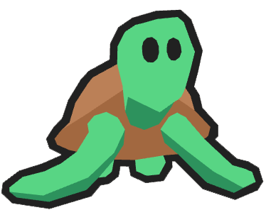

<p align="center">
  
  <h1 align="center">Infinite Turtles</h1>
</p>

Infinite Turtles is a card game made for the Svelte 2024/25 hackathon. It is built with [Threlte](https://threlte.xyz/), a library for using [Three.js](https://threejs.org/) in [Svelte](http://svelte.dev/) apps.

The project is still a work in progress with many features still to add, including sound effects, improved animations and more varied gameplay. Feedback is welcome!

### Local Developing

Once you've cloned the project and installed dependencies with `npm install`, start a development server:

```bash
npm run dev
```

🐢
